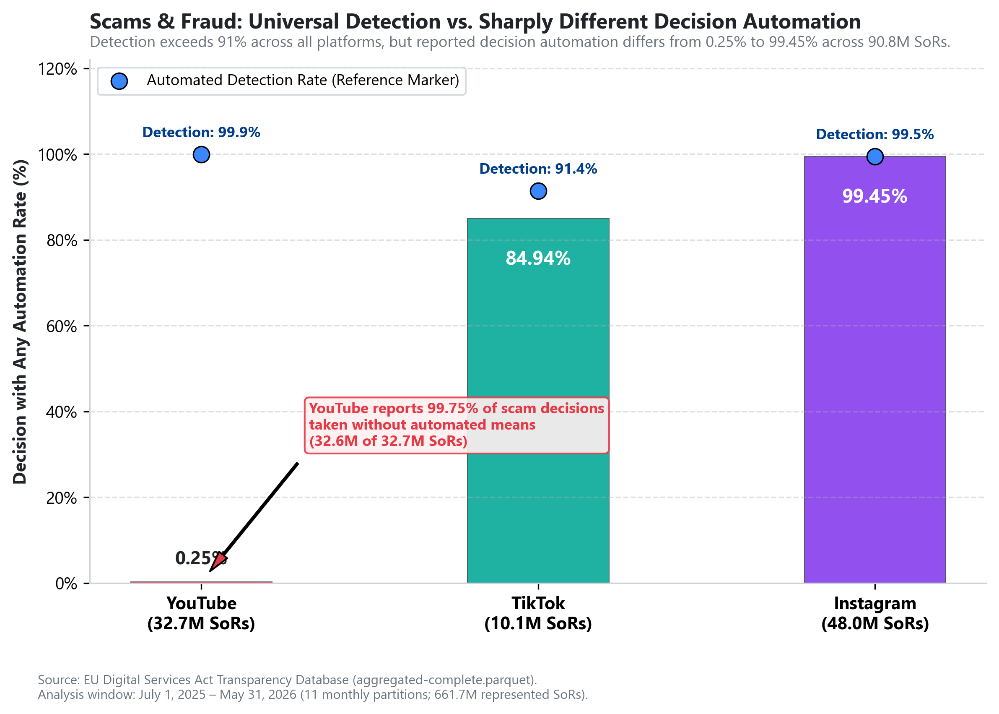
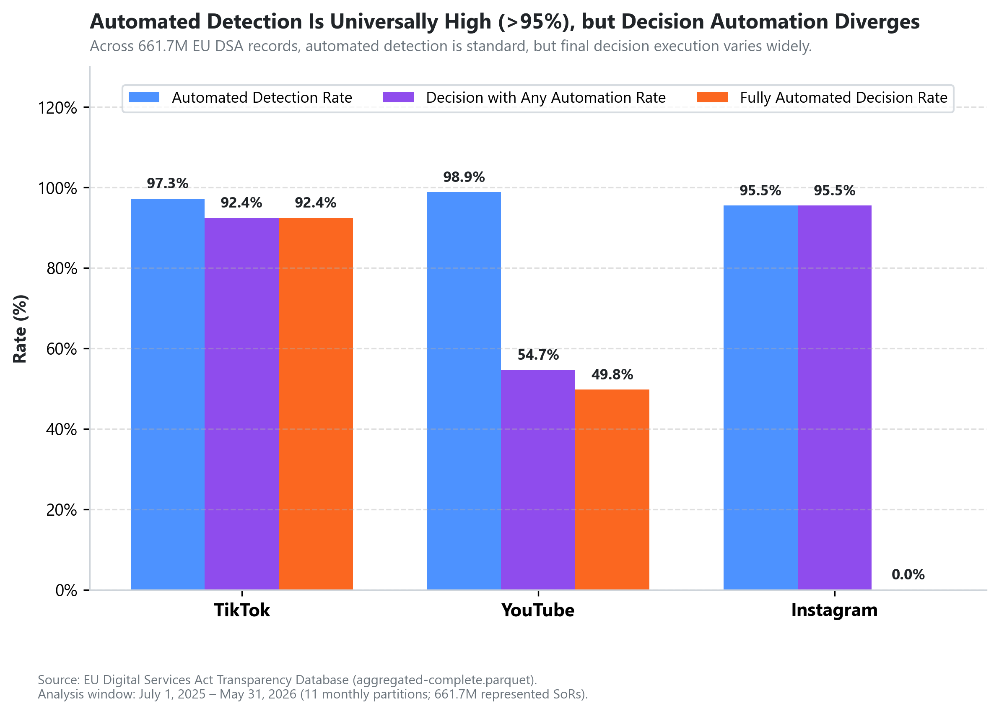
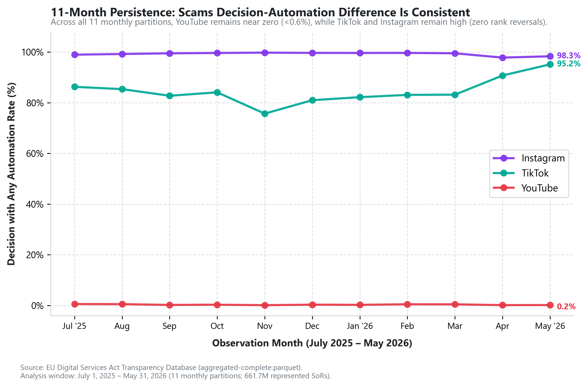
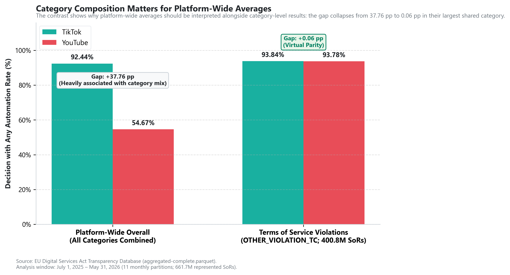
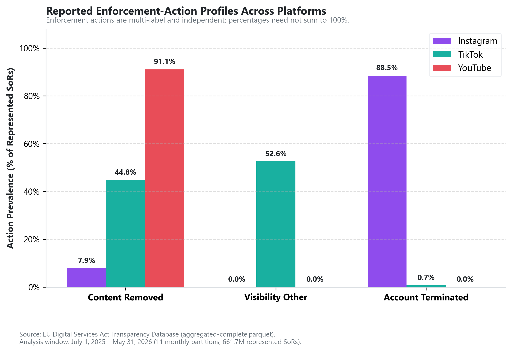

# Cross-Platform Content Moderation Benchmark

**661.7M EU DSA moderation records reveal similar automated detection — but sharply different decision-stage automation in Scams & Fraud.**

[](https://www.python.org/downloads/)
[](https://transparency.dsa.ec.europa.eu/)
[]()
[](MAPPING.md)

---

## Key Finding

```
========================================================================================
"Automated detection is nearly universal across TikTok, YouTube, and Instagram, but
decision-stage automation diverges sharply in Scams & Fraud: YouTube reports only 0.25%
of scam/fraud decisions with any automation, versus 84.94% for TikTok and 99.45% for Instagram."
========================================================================================
```

Across **90,782,865 represented Statements of Reasons** in **Scams & Fraud**, automated detection exceeds 91% across all platforms, yet final decision execution diverges by up to 99 percentage points:
- **YouTube**: **0.25%** Decision with Any Automation (81,048 of **32,688,662 SoRs**; 99.75% reported as decisions taken without automated means)
- **TikTok**: **84.94%** Decision with Any Automation (8,597,144 of **10,121,069 SoRs**; 84.94% fully automated)
- **Instagram**: **99.45%** Decision with Any Automation (47,710,406 of **47,973,134 SoRs**; 98.77% account terminated)

This pattern is temporally persistent across all 11 continuous monthly observation partitions with **zero rank reversals**.



---

## Why It Matters

In modern Trust & Safety engineering, high-volume automated detection is standard practice across all major platforms. However, the benchmark shows that similar automated-detection rates can coexist with very different reported levels of decision-stage automation.

Platform-wide averages can also obscure category-specific behavior: the largest differences appear in particular policy areas rather than across the board. For Trust & Safety teams, identifying these category-level divergences provides an empirical starting point for investigating whether differences reflect distinct operational trade-offs (such as handling time, false-positive risk, or review capacity) or reporting-architecture artifacts.

---

## Dataset

This study analyzes standardized, regulatory disclosures submitted under Article 17 of the **EU Digital Services Act (DSA)**:
- **Data Source**: European Commission DSA Transparency Database ([transparency.dsa.ec.europa.eu](https://transparency.dsa.ec.europa.eu)).
- **Benchmark Platforms**: **TikTok**, **YouTube**, and **Instagram**.
- **Observation Window**: **July 1, 2025 through May 31, 2026** (11 continuous monthly partitions under the post-June 2025 harmonized schema).
- **Benchmark Population**: Exactly **661,664,998 represented Statements of Reasons (SoRs)** across 17,223,049 physical Parquet records.
  - **TikTok**: 480,532,153 SoRs (72.62%)
  - **YouTube**: 88,376,558 SoRs (13.36%)
  - **Instagram**: 92,756,287 SoRs (14.02%)

---

## Methodology

The benchmark pipeline strictly enforces the 12 approved methodological rules documented in [MAPPING.md](MAPPING.md):
- **Detection vs. Decision Separation**: Distinguishes `automated_detection` (flagging stage) from `automated_decision` (final sanction execution).
- **Exact Schema Semantics**: Preserves literal regulatory definitions (`AUTOMATED_DECISION_FULLY`, `AUTOMATED_DECISION_PARTIALLY`, `AUTOMATED_DECISION_NOT_AUTOMATED`) without inferring unmeasured internal workflows.
- **Volume-Weighted Aggregation**: All category shares, platform rates, and prevalence metrics are weighted by `SUM(count)`.
- **Category-Level Sparsity Standard**: Explicit 48-slice Cartesian grid (3 platforms × 16 categories); zero-volume slices report `NaN`/null (never false 0.0%) and shares $<0.10\%$ are flagged as sparse.
- **Practical Effect Sizes Over P-Values**: Evaluates substantive effect magnitude (percentage-point differences and rate ratios) rather than $p$-values, which become uninformative on datasets of 660M+ records.

For complete verification logs and independent replication checks, see [reports/phase5_validation.md](reports/phase5_validation.md).

---

## Findings

### 1. Automated Detection Is Universally High (>95%)
All three platforms detect $>95.5\%$ of violative content through automated systems (spread: **3.36 pp**; rate ratios: 0.98x–1.04x). Detection automation is an industry-wide commodity that provides negligible competitive differentiation.



### 2. The Scams & Fraud Decision-Automation Divide (Primary Finding)
In Scams & Fraud (90.8M SoRs), platforms diverge diametrically: YouTube reports only **0.25%** of decisions involving automated means (99.75% taken without automated means), while TikTok automates **84.94%** fully, and Instagram reports **99.45%** with automated participation (and 98.77% account termination).


### 3. Persistent 11-Month Stability
Across all 11 monthly partitions from July 2025 to May 2026, the scam decision-automation ranking never reverses. YouTube's monthly decision-automation rate in scams is consistently $<0.6\%$ in every single month.



### 4. Category Composition Explains Platform-Wide Gaps
While TikTok leads YouTube by **37.76 percentage points** in overall decision automation (92.44% vs 54.67%), this gap collapses to **0.06 percentage points** in their largest shared category (**Terms of Service violations**, 400.8M SoRs combined), where TikTok reports **93.84%** and YouTube reports **93.78%** decision automation. Aggregate platform averages are heavily distorted by category composition.



### 5. Divergent Enforcement Compliance Architectures
Platforms enforce actions at different entity layers: Instagram enforces primarily via account termination (**88.47%** overall; and in Scams & Fraud, **98.7735%** [47,384,761 of 47,973,134 SoRs] record `ACCOUNT_TERMINATED`), YouTube enforces almost exclusively via content removal (**91.07%**), and TikTok deploys non-removal visibility restrictions (**52.57%**) alongside content removals (**44.76%**).



---

## Actionable Recommendation

```
========================================================================================
RECOMMENDATION:
Safety teams should audit the decision-stage automation boundary in Scams & Fraud.
Where automation is unusually low or high relative to peers, evaluate:
- false-positive rates
- appeal rates
- reversal rates
- handling time
- harm severity
- escalation patterns
before changing the automation mix.
========================================================================================
```

The benchmark identifies **WHERE investigation is warranted**; it does not declare which platform has the "optimal" automation level. Teams must evaluate operational capacity and handling latency against false-positive risks before altering automation thresholds.

---

## Repository Structure

```text
dsa-moderation-benchmark/
├── .gitignore               # Excludes raw Parquet files, virtual environments, caches
├── requirements.txt         # Lightweight runtime dependencies for Streamlit deployment (pandas, plotly, streamlit)
├── requirements-analysis.txt # Full local data acquisition & analysis environment (dsa-tdb, pyarrow, matplotlib, jupyter)
├── app.py                   # Phase 8 interactive Streamlit portfolio dashboard
├── README.md                # Project landing page and executive summary
├── MAPPING.md               # Authoritative 12-rule methodological specification
├── data/
│   ├── raw/                 # Untouched raw Parquet aggregates & supplementary data (gitignored)
│   └── processed/           # Compact, reproducible analytical CSV tables
│       ├── category_volume.csv                 # 48 rows: Cartesian volume and sparsity
│       ├── automation_overall.csv              # 3 rows: Platform-wide benchmark metrics
│       ├── automation_by_category.csv          # 48 rows: Category automation metrics
│       ├── automation_monthly.csv              # 33 rows: Monthly time-series
│       ├── automation_category_monthly.csv     # 409 rows: Category-monthly panel
│       ├── enforcement_action_prevalence.csv   # 720 rows: Granular action prevalence
│       ├── enforcement_action_overall.csv      # 45 rows: Platform-wide action prevalence
│       └── platform_effect_sizes.csv           # 9 rows: Pairwise effect sizes
├── reports/
│   ├── final_report.md                         # Comprehensive portfolio final report
│   ├── phase5_validation.md                    # Exact arithmetic and reconciliation audit
│   ├── phase6_candidate_findings.md            # Scorecard and root-cause decompositions
│   ├── supplementary_data_manifest.md          # 21-quarter supplementary data catalog
│   └── charts/                                 # High-resolution benchmark PNG charts
│       ├── 01_detection_vs_decision.png
│       ├── 02_scams_decision_automation.png    # HERO CHART
│       ├── 03_scams_monthly_consistency.png
│       ├── 04_category_mix_context.png
│       └── 05_enforcement_actions.png
└── src/
    ├── dashboard_utils.py   # Cached data loader, color constants, and Plotly layout helpers
    ├── download_dsa.py      # Automated DSA Parquet acquisition pipeline
    ├── download_supplementary.py # Supplementary platform transparency scraper
    ├── load_dsa.py          # Memory-efficient PyArrow chunked data loader
    ├── metrics.py           # Reproducible Phase 5 metric computation engine
    └── visualize.py         # Phase 7 publication-quality chart generator
```

---

## Interactive Dashboard

An interactive, command-center Streamlit dashboard is included for exploring the benchmark findings, category distributions, monthly time series, and enforcement profiles. The dashboard reads strictly from committed files in `data/processed/` and requires no external downloads or database setup.

### Launch Locally (Dashboard Only):
```bash
pip install -r requirements.txt
streamlit run app.py
```

The application provides:
- **Executive Hero**: Immediate 30-second summary of the primary finding in Scams & Fraud.
- **Stage Comparison**: Visual proof separating universally high detection (>95%) from divergent decision automation.
- **Scams & Fraud Deep Dive**: Platform cards with exact regulatory decision semantics (`FULLY`, `PARTIALLY`, `NOT_AUTOMATED`).
- **11-Month Robustness**: Monthly panel tracking zero rank reversals across 11 partitions.
- **Category Explorer**: Interactive policy category inspection with automatic sparsity filtering (`<0.10%` share).
- **Composition Analysis**: Side-by-side contrast demonstrating how platform-wide averages collapse to parity in core Terms of Service enforcements.
- **Enforcement Action Profiles**: Multi-label prevalence breakdown across content and account-level restrictions.

---

## Reproduce

To reproduce this benchmark from scratch:

### 1. Prerequisites & Environment Setup

`requirements.txt` is intentionally lightweight for Streamlit deployment, containing only the runtime dependencies needed to run `app.py` from committed processed CSVs. `requirements-analysis.txt` contains the full data acquisition and analysis environment including `dsa-tdb`, `pyarrow`, `matplotlib`, and `jupyter` (requires Python $\ge 3.10, < 3.14$).

```bash
git clone https://github.com/AmitejSingh1/dsa-moderation-benchmark.git
cd dsa-moderation-benchmark

# Create and activate virtual environment
python -m venv .venv
# Windows:
.\.venv\Scripts\Activate.ps1
# Linux / macOS:
source .venv/bin/activate
```

#### Option A: Dashboard Only (Lightweight)
```bash
pip install -r requirements.txt
streamlit run app.py
```

#### Option B: Full Local Analysis & Data Acquisition
```bash
# Install complete acquisition/analysis stack (includes EC GitLab registry for dsa-tdb)
pip install -r requirements-analysis.txt
```

### 2. Acquire Official DSA Parquet Aggregates
Raw data files (~5.15 GB) are excluded from Git and must be downloaded locally:
```bash
# Acquire complete monthly aggregates (2023-09-25 through 2026-05-31)
python src/download_dsa.py --from-date 2023-09-25 --to-date 2026-05-31
```

### 3. Compute Validated Benchmark Metrics
Transforms raw Parquet partitions into compact analytical CSVs in `data/processed/`:
```bash
python src/metrics.py
```

### 4. Regenerate Benchmark Visualizations
Renders all publication-quality static PNG charts in `reports/charts/`:
```bash
python src/visualize.py
```

### 5. Launch Interactive Portfolio Dashboard
```bash
streamlit run app.py
```

---

## Limitations

- **Administrative Reporting Boundary**: Statements of Reasons measure actions taken and reported under Article 17, not the total prevalence of violative content on platforms.
- **Accuracy Is Not Measured**: DSA aggregates record automation involvement; they do not measure precision, recall, or false-positive rates.
- **No Appeal Outcomes in Aggregates**: Parquet aggregates do not link initial SoRs to user appeal outcomes or content restoration rates.
- **Within-Category Composition**: Unobserved differences in language, content format (short-form video vs long-form video vs image), or geographic origin may exist within categories.
- **TikTok Batch Reporting**: TikTok's January 2026 volume contains delayed batch submissions, but sensitivity analysis confirms that excluding January shifts its automation metrics by $<0.25$ percentage points.

---

## Full Report

For complete methodological discussions, sensitivity decompositions, and extended operational analyses, read the **[Full Benchmark Report](reports/final_report.md)**.

